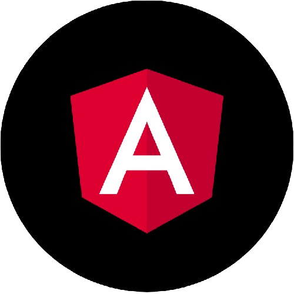
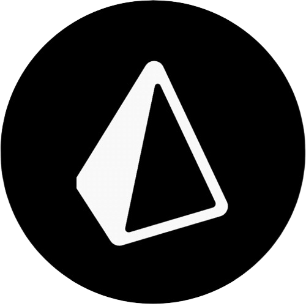
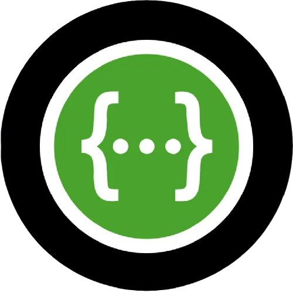
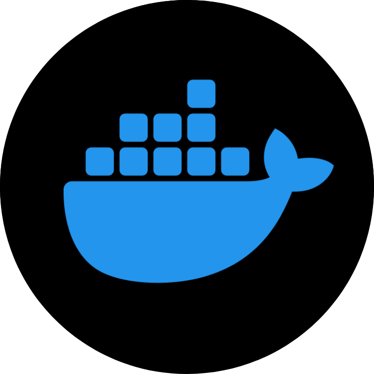
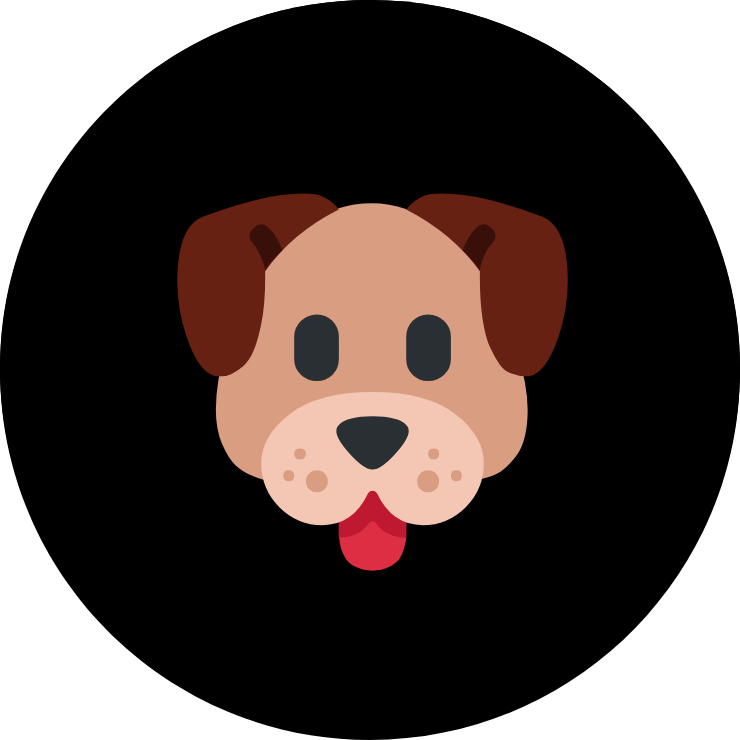
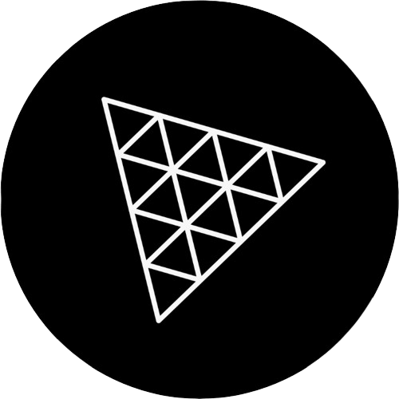
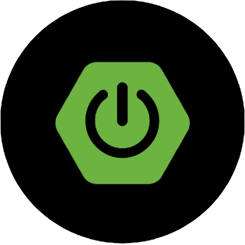
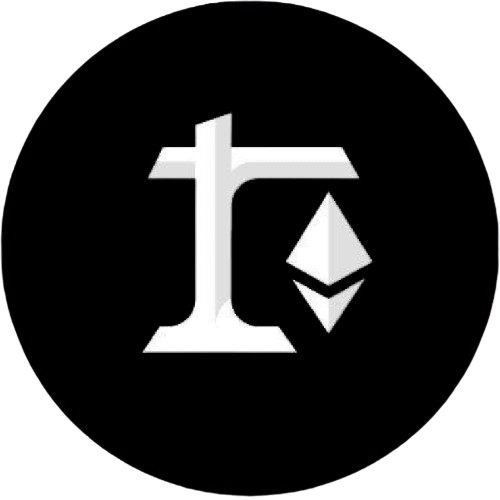

# Hi there, I'm [Jorge Sarricolea](https://jorgesarricolea.com) 👋

### Software Engineer | Expert in JavaScript/TypeScript & Java/Spring Boot | 4+ Years Building Scalable Applications | Focused on Modern Web Development, Microservices, and Cloud Architecture

Software Engineer with over 4 years of experience building scalable applications using both modern JavaScript ecosystem and enterprise Java technologies. Proficient in full-stack development with Node.js, React, Next.js for web applications, and Java Spring Boot for robust backend systems and microservices architecture.

I specialize in designing and implementing scalable solutions using the best of
both worlds: modern JavaScript for responsive frontends and rapid development, combined with Java's enterprise-grade reliability for critical backend systems. Experience includes leading technical initiatives, mentoring development teams, and delivering high-impact applications that handle complex business requirements and scale to serve thousands of users.

## My stack:

<table>
  <tr>
    <td align="center"><strong>Languages 🌟</strong></td>
    <td align="center"><strong>Front-End 🎨</strong></td>
    <td align="center"><strong>Back-End ⚙️</strong></td>
  </tr>
  <tr>
    <td valign="top">
        
        
    </td>
    <td valign="top">
      
      
      
      
      
    </td>
    <td valign="top">
      
      
      
    </td>
  </tr>
</table>

<table>
  <tr>
    <td align="center"><strong>Cloud ☁️</strong></td>
    <td align="center"><strong>Testing and Tools ⚙️</strong></td>
    <td align="center"><strong>CI/CD 🔀</strong></td>
    <td align="center"><strong>Databases 🗄️</strong></td>
  </tr>
  <tr>
    <td valign="top">
      
    </td>
    <td valign="top" style="width: 50%;">
      
      
      
      
      
    </td>
    <td valign="top" style="width: 50%;">
      
      
    </td>
    <td valign="top" style="width: 50%;">
      
      
    </td>
  </tr>
</table>

## More skills:

<table>
  <tr>
    <td align="center"><strong>Languages 💡</strong></td>
    <td align="center"><strong>Front-End 🎨</strong></td>
    <td align="center"><strong>Back-End ⚙️</strong></td>
    <td align="center"><strong>Blockchain ⛓️</strong></td>
  </tr>
  <tr>
    <td valign="top">
        
        
      
    </td>
    <td valign="top">
      
      
      
      
      
      
    </td>
    <td valign="top">
      
      
      
    </td>
    <td valign="top">
      
      
    </td>
  </tr>
</table>

<table>
  <tr>
    <td colspan="2" align="center"><strong>Stats 📈</strong></td>
  </tr>
  <tr>
    <td valign="top">
      
    </td>
    <td valign="top">
      
    </td>
  </tr>
</table>

