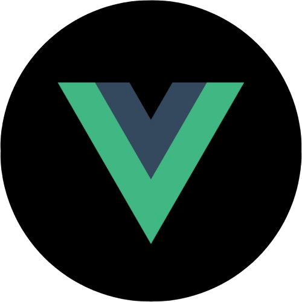
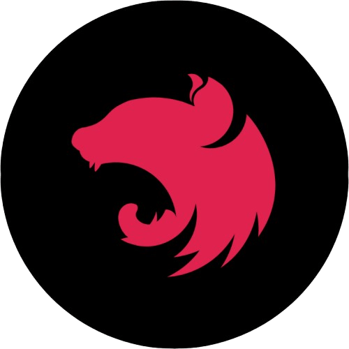
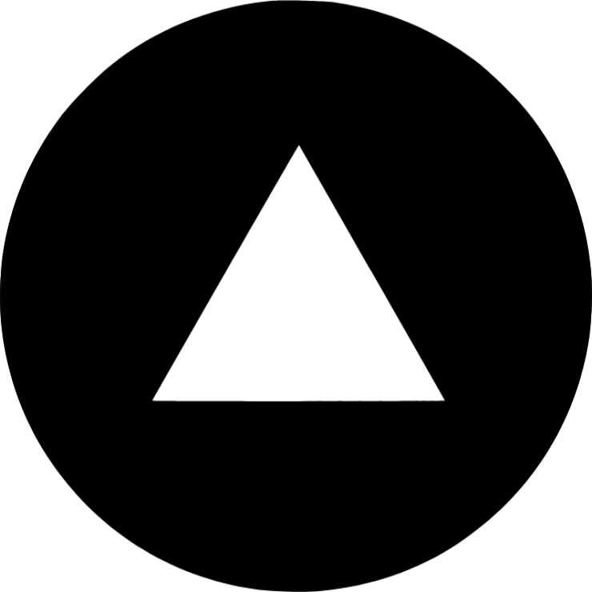
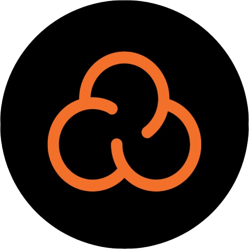
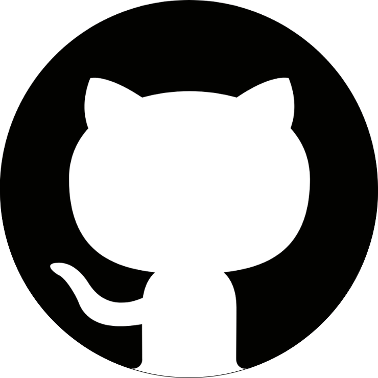
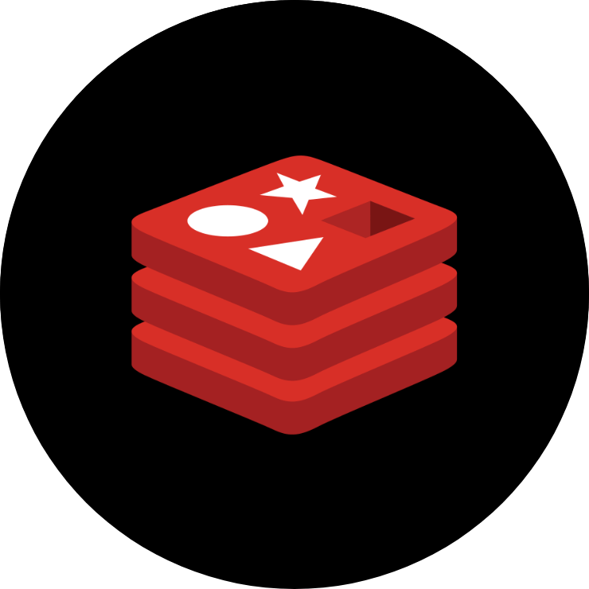
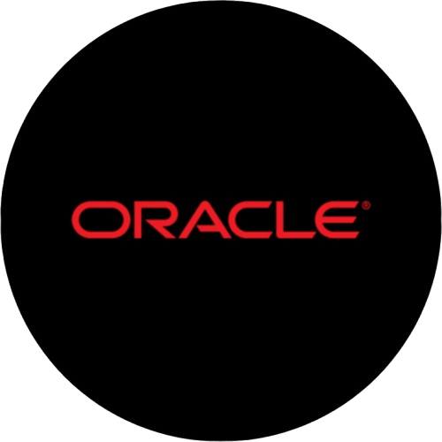

# Hi there, I'm [Jorge Sarricolea](https://jorgesarricolea.com) 👋

### Software Engineer | 4+ Years Building Scalable Applications | Full-Stack Developer | Cloud & Product-Oriented Engineering

I'm a multidisciplinary Software Engineer with over 4 years of experience building full-stack web applications, distributed backend systems, and user-centered interfaces. I thrive in projects that demand both technical depth and product impact—designing scalable architectures, developing robust APIs, and delivering performant, responsive UIs.

From leading technical teams to shipping production-ready features, I’ve contributed across multiple sectors including finance, education, and blockchain. My strengths lie in building modular services, implementing authentication, automating infrastructure with CI/CD, and applying architectural best practices like SOLID principles and clean code.

I enjoy working across the stack—from systems and services to the user experience—always with a focus on code quality, scalability, and reliability.

## My stack:

<table>
  <tr>
    <td align="center"><strong>Languages 🌟</strong></td>
    <td align="center"><strong>Front-End 🎨</strong></td>
    <td align="center"><strong>Back-End ⚙️</strong></td>
  </tr>
  <tr>
    <td valign="top">
      
      
      
      
      
    </td>
    <td valign="top">
      
      
      
      
      
      
      
      
      
      
      
    </td>
    <td valign="top">
      
      
      
      
      
      
      
    </td>
  </tr>
</table>

<table>
  <tr>
    <td align="center"><strong>Cloud ☁️</strong></td>
    <td align="center"><strong>Testing & Tools 🔍</strong></td>
    <td align="center"><strong>CI/CD 🚀</strong></td>
    <td align="center"><strong>Databases 🗄️</strong></td>
  </tr>
  <tr>
    <td valign="top">
      
      
    </td>
    <td valign="top">
      
      
      
      
      
      
    </td>
    <td valign="top">
      
      
      
    </td>
    <td valign="top">
      
      
      
      
    </td>
  </tr>
</table>

## More skills:

<table>
  <tr>
    <td align="center"><strong>Blockchain ⛓️</strong></td>
  </tr>
  <tr>
    <td valign="top">
      
      
    </td>
  </tr>
</table>

<table>
  <tr>
    <td colspan="2" align="center"><strong>Stats 📈</strong></td>
  </tr>
  <tr>
    <td valign="top">
      
    </td>
    <td valign="top">
      
    </td>
  </tr>
</table>
