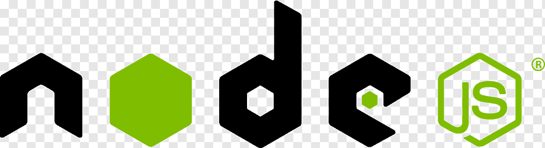
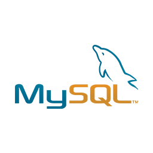
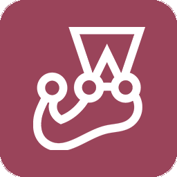
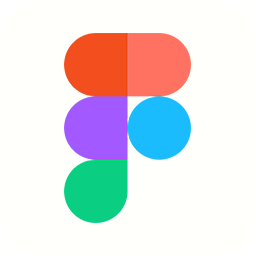
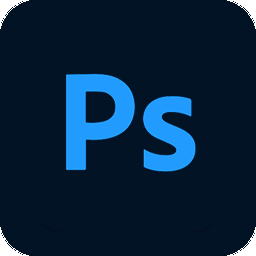

# Hi there, I'm [Jorge Sarricolea](https://jorgesarricolea.com) 👋

I am a passionate Frontend Developer and UX/UI Designer with over 2 years of experience in the field. Throughout my career, I have worked on a variety of projects, both personal and team-based, which has allowed me to acquire a wide range of skills and creative approaches.

I believe that teamwork is essential to achieving success in any project. I firmly believe that by collaborating and sharing ideas, we can achieve exceptional results.

One of my most significant achievements has been the complete development of a marketplace similar to Fiverr, where I had the opportunity to program the site from scratch. [Jumwork](https://jumwork.com) was an exciting challenge, featuring a bidding system, notifications, and an integrated chat. During this project, I not only applied my Frontend Developer skills but also delved into Backend development, working with APIs such as Stripe and AirTable.

## What I know:

### Languajes 💡

### Frontend 🖥️

 

### Backend and Database 🖥️

### Development and Testing Tools ⚙️

### Design Tools 🎨

#### _To achieve real change, order, discipline, and consistency are required._
